Personal notes on how Django works

# [Tutorial Part 1:](https://docs.djangoproject.com/en/3.0/intro/tutorial01/)

# [Tutorial Part 2:](https://docs.djangoproject.com/en/3.0/intro/tutorial02/)

# [Tutorial Part 3:](https://docs.djangoproject.com/en/3.0/intro/tutorial03/)

> When somebody requests a page from your website – say, “/polls/34/”, Django
> will load the mysite.urls Python module because it’s pointed to by the
> ROOT_URLCONF setting. It finds the variable named urlpatterns and traverses
> the patterns in order. After finding the match at 'polls/', it strips off
> the matching text ("polls/") and sends the remaining text – "34/" – to the
> ‘polls.urls’ URLconf for further processing. There it matches '<int
> :question_id>/', resulting in a call to the detail() view like so:

## How django processes a request

```plantuml 
start
:GET "/polls/34";
if (mysite.urls in ROOT_URLCONF) then (true)
    :load mysite.urls.py;
else (false)
    stop
endif
:traverse list urlpatterns;
if ( 'polls/' in urlpatterns) then (true)
    :strip matching text 'polls/';
    :send remaining text "34/" to the polls.url URLconf; 
else (false)
    stop
endif
:send '34' to detail();
:detail(request=<HttpRequest object>, question_id=34);
stop
@startsalt
{
  Login    | "MyName   "
  Password | "****     "
  [Cancel] | [  OK   ]
}
@endsalt
```

